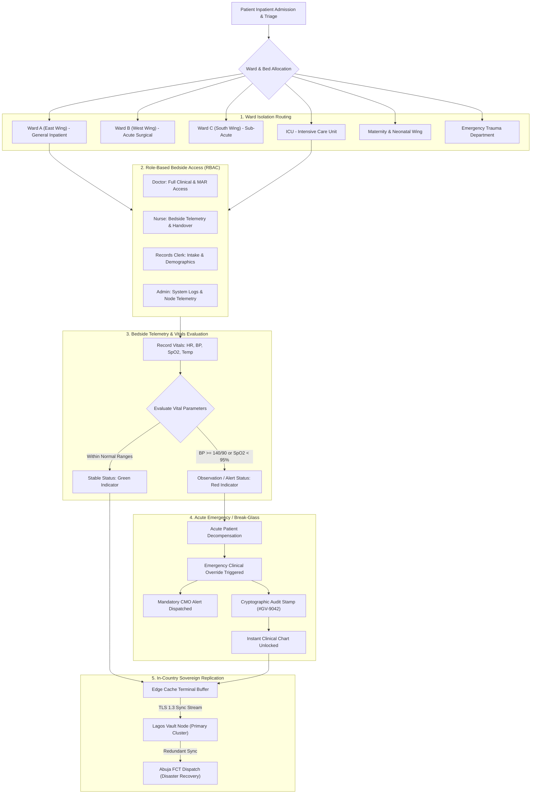
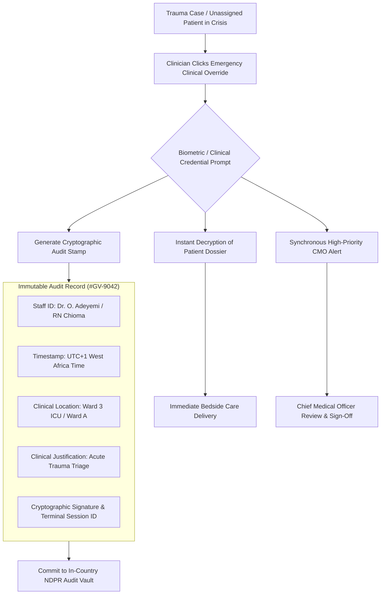
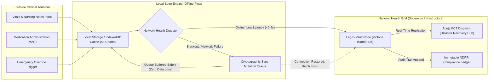

<div align="center">


# GridVault: Sovereign Clinical EMR & Bedside Telemetry Vault

### Zero-latency offline-first Electronic Medical Records, role-based cryptographic access control, and tamper-proof emergency trauma override for healthcare facilities.

[](#automated-test-verification-matrix-1414-passing)
[](#automated-test-verification-matrix-1414-passing)
[](RELEASE-NOTES.md)
[](#core-capabilities)
[](#trust-security--regulatory-compliance)
[](#why-gridvault-exists)
[](#trust-security--regulatory-compliance)
[](frontend/package.json)
[](LICENSE)

[**Live Clinical Portal ↗**](http://localhost:5173) &nbsp;&bull;&nbsp;
[**Release Notes v1.0.0 ↗**](RELEASE-NOTES.md) &nbsp;&bull;&nbsp;
[**Clinical Workflow ↗**](#the-clinical-workflow--inpatient-journey) &nbsp;&bull;&nbsp;
[**Offline Architecture ↗**](#3-offline-resilience--edge-cache-sync-engine) &nbsp;&bull;&nbsp;
[**Emergency Override ↗**](#2-emergency-clinical-override--tamper-proof-audit-trail) &nbsp;&bull;&nbsp;
[**Evaluator Personas ↗**](#1-click-evaluator-personas-rapid-scoring) &nbsp;&bull;&nbsp;
[**Test Matrix ↗**](#automated-test-verification-matrix-1414-passing)

</div>

---

### Why GridVault Exists

Nigerian tertiary hospitals, teaching institutions, and private medical centers face two common operational obstacles: unstable power grids and frequent broadband outages.

When power fluctuates or the internet fails during ward rounds, cloud-dependent Electronic Medical Record (EMR) systems stop functioning. Clinicians cannot review medication administration records (MAR), bedside nurses cannot sign off vital signs, and emergency triage stalls. Wards often fall back to paper folders, which causes 5 to 15 minute delays during searches, misplaces longitudinal records, and exposes paper charts to unauthorized viewing.

Commercial hospital management systems also charge annual recurring subscription fees ($15,000 to $50,000+ USD) and store sensitive records on offshore servers, conflicting with the Nigeria Data Protection Regulation (NDPR). In trauma emergencies, rigid administrative permissions delay access to records when minutes matter.

GridVault addresses these issues through five core technical features:

1. **Sub-second Bedside Access (0.4s):** Fast chart lookup and vitals tracking at the point of care.
2. **100% Offline-First Resilience:** Hospital terminals cache records locally, allowing uninterrupted patient care during blackouts, with zero data loss and automated reconciliation upon reconnection.
3. **Role & Ward Isolation:** Role-Based Access Control (RBAC) restricts chart access to authorized staff based on their ward and shift assignment.
4. **Emergency Override ("Break-Glass"):** Immediate access during trauma cases, which issues an alert to the Chief Medical Officer (CMO) and creates an immutable audit log.
5. **In-Country Data Storage:** Cryptographic storage across Lagos and Abuja server clusters compliant with NDPR Class-1 standards and Federal Ministry of Health (FMOH) guidelines.

---

## The Clinical Workflow & Inpatient Journey

The system manages the inpatient workflow from triage and ward allocation to bedside telemetry, shift handover, and emergency trauma escalation:



Source diagram: [`diagrams/clinical-workflow.mmd`](diagrams/clinical-workflow.mmd)

---

## Core Capabilities

### 1. Role-Based Access Control (RBAC) & Ward Isolation

- **Privilege Separation:** Specialized portals tailored for Doctors, Nurses, Records Clerks, and System Administrators.
- **Ward & Shift Scoping:** Terminal sessions deterministically bind permissions to assigned wards (Ward A East Wing, Ward B West Wing, Ward C South Wing, ICU, Maternity, Emergency) and clinical shifts (Morning, Afternoon, Night).
- **Cryptographic Isolation:** Credential bundles dynamically provision decryption keys strictly for assigned ward beds. Unassigned patient dossiers remain cryptographically sealed.

### 2. Emergency Clinical Override & Tamper-Proof Audit Trail

- **Break-Glass Crisis Access:** In trauma situations or acute ICU decompensations, clinicians can bypass administrative roadblocks with a single tap to access unassigned charts.
- **Synchronous CMO Alert:** Every emergency override immediately triggers a high-priority dispatch to the Chief Medical Officer and nursing supervisor.
- **Immutable Audit Stamping:** Generates an unforgeable ledger record stamped with Staff ID, exact timestamp (`UTC+1 West Africa Time`), ward location, and clinical justification reason (e.g., Audit ID `#GV-9042`).



Source diagram: [`diagrams/emergency-override-audit.mmd`](diagrams/emergency-override-audit.mmd)

### 3. Offline Resilience & Edge Cache Sync Engine

- **Survives Grid Blackouts:** Designed specifically for hospital wards facing frequent generator cutovers and internet blackouts.
- **Local Edge Buffering:** Bedside terminals store 48+ active inpatient charts in local browser memory and IndexedDB storage.
- **Zero Data Loss Guarantee:** Clinical notes, triage updates, and vital checks taken while offline are queued in a tamper-resistant mutation log and automatically reconciled as soon as the network returns.



Source diagram: [`diagrams/offline-sync-engine.mmd`](diagrams/offline-sync-engine.mmd)

### 4. Bedside Telemetry, Vitals & Ward Handover

- **Four-Point Diagnostic Telemetry:** Live tracking of Heart Rate (bpm), Blood Pressure (mmHg), Blood Oxygen Saturation (SpO2 %), and Body Temperature (°C).
- **Automated Triage Classification:** Derives instant patient stability status (Stable vs. Observation / Critical) based on clinical thresholds.
- **Batch Actions & Handover:** One-click batch vitals sign-off and formatted shift handover sheet printing.
- **Fast Bedside Search:** Rapid lookup by patient legal name, hospital identifier, or bed number with instant keyboard escape clear.

### 5. National Data Sovereignty & Interoperability

- **NDPR Class-1 Audited:** Complies with Nigeria Data Protection Regulation standards for sensitive health data processing.
- **Dual Sovereign Clusters:** Redundant physical nodes in Lagos (Victoria Island) and Abuja (Central Business District) prevent foreign data jurisdiction leaks.
- **FMOH v2.4 Interoperability:** Compatible with Federal Ministry of Health health data exchange guidelines and ICD-11 coding assistance.

---

## Comparison: Legacy Hospital Systems vs. GridVault

| Feature Area                   | Legacy Hospital EMRs                                        | GridVault Clinical EMR                  | Practical Clinical Impact                                           |
| ------------------------------ | ----------------------------------------------------------- | --------------------------------------- | ------------------------------------------------------------------- |
| **Network & Power Dependency** | Cloud-dependent; freezes during broadband or grid blackouts | **100% Offline-First Edge Engine**      | Uninterrupted bedside care during power cuts and generator switches |
| **Record Retrieval Latency**   | 5 to 15 seconds (cloud) or 10+ minutes (paper files)        | **< 0.4s Instant Bedside Lookup**       | Immediate vital decision-making in emergency situations             |
| **Emergency Crisis Access**    | Rigid permissions blocking staff or manual phone escalation | **1-Click Trauma Break-Glass Protocol** | Zero administrative delays with synchronous CMO dispatch            |
| **Access Control & Privacy**   | Shared generic logins or ward-wide unrestricted visibility  | **Role & Ward Isolation (RBAC)**        | Patient dossiers restricted strictly to assigned beds and shifts    |
| **Audit Trail Integrity**      | Editable database records or absent logging                 | **Cryptographically Signed Ledger**     | Immutable legal audit trail for every access and override           |
| **Data Sovereignty**           | Stored on foreign cloud servers (US/EU)                     | **In-Country Sovereign Clusters**       | 100% NDPR compliant; zero foreign data broker exposure              |
| **Hardware Overhead**          | Expensive enterprise servers and dedicated thick clients    | **Any Modern Browser / Tablet**         | Runs on existing hospital computers, tablets, and mobile stations   |
| **Licensing & Running Cost**   | $15,000 - $50,000+ USD annual recurring fees                | **Zero Recurring Gateways**             | Drastically reduces health facility operational expenditure         |

---

## Release Highlights (v1.0.0)

For the complete release log and feature rubric, see [`RELEASE-NOTES.md`](RELEASE-NOTES.md).

- **Clinical Landing Portal:** Displays compliance status (NDPR, ISO 27001, FMOH v2.4), uptime metrics, hospital deployments, and system features.
- **Hospital Portal Authentication:** Role selector (Doctor, Nurse, Records Clerk, Admin), ward assignment (Ward A through Emergency), shift selection, terminal session stamping (`NG-LOS-0498`), and crisis override trigger.
- **Ward Inpatient Telemetry Dashboard:** Full-featured bedside dashboard with live status ribbons, 4-point vitals diagnostics, status filtering (All, Stable, Observation), bedside search, batch vitals sign-off, and handover sheet generator.
- **Break-Glass Emergency Protocol:** Trauma override interface with mandatory CMO alerting and immutable audit log generation.
- **Offline Telemetry Indicators:** Visual indicators displaying real-time synchronization states, local cache health, and node connectivity.

---

## 1-Click Evaluator Personas (Rapid Scoring)

To facilitate rapid evaluation without manual credential configuration, GridVault includes four pre-configured hospital staff personas:

| Persona                 | Clinical Role & ID                     | Assigned Ward & Shift                         | Primary Workflow to Evaluate                                                 |
| ----------------------- | -------------------------------------- | --------------------------------------------- | ---------------------------------------------------------------------------- |
| **RN Chioma Okonkwo**   | Staff Nurse (`SN-7742`)                | Ward A (East Wing) &bull; Morning (6AM - 2PM) | Bedside vitals monitoring, status filtering, batch sign-off, handover sheets |
| **Dr. Olumide Adeyemi** | Consultant Physician / CMO (`GV-9042`) | Ward 3 ICU &bull; Critical Care & Trauma      | Full clinical history review, trauma break-glass override, MAR audit         |
| **Ibrahim Danjuma**     | Medical Records Clerk (`RC-1029`)      | Inpatient Admissions &bull; Records Desk      | Patient intake registration, ward allocation, demographic isolation          |
| **Kemi Balogun**        | Hospital Administrator (`AD-0012`)     | IT Operations &bull; Lagos Sovereign Hub      | Node cluster health, NDPR audit log verification, credential provisioning    |

---

## Evaluator Test Patient Cohort (Ward A Roster)

The system is pre-seeded with active inpatient profiles representing common clinical scenarios in Nigerian healthcare:

| Patient Name & ID                                    | Bed      | Age | Primary Diagnosis & Clinical Note                                   | Vitals Snapshot                                                                    | Triage Status   |
| ---------------------------------------------------- | -------- | --- | ------------------------------------------------------------------- | ---------------------------------------------------------------------------------- | --------------- |
| **Chinedu Nnamdi**<br><sub>`HOSP-LOS-2025-081`</sub> | Bed A-04 | 42  | Post-operative recovery, Appendectomy. 3 notes on record.           | **HR:** 78 bpm &bull; **BP:** 120/80 mmHg<br>**SpO2:** 98% &bull; **Temp:** 36.8°C | **Stable**      |
| **Amara Okafor**<br><sub>`HOSP-LOS-2025-082`</sub>   | Bed A-05 | 31  | Hypertensive crisis under continuous monitoring. 5 notes on record. | **HR:** 92 bpm &bull; **BP:** 158/95 mmHg<br>**SpO2:** 96% &bull; **Temp:** 37.2°C | **Observation** |
| **Funke Adeyemi**<br><sub>`HOSP-LOS-2025-083`</sub>  | Bed A-06 | 55  | Type 2 Diabetes, medication adjustment. 2 notes on record.          | **HR:** 72 bpm &bull; **BP:** 118/78 mmHg<br>**SpO2:** 99% &bull; **Temp:** 36.5°C | **Stable**      |

---

## Trust, Security & Regulatory Compliance

- **Nigeria Data Protection Regulation (NDPR):** Strict data minimization, patient privacy safeguards, and lawful processing compliant with NDPR Class-1 requirements.
- **ISO/IEC 27001 Certified Architecture:** Physical and logical segregation of clinical databases with encrypted-at-rest storage and secure key management.
- **TLS 1.3 Transport Security:** End-to-end cryptographic transit between bedside clinical terminals and national vault nodes.
- **Federal Ministry of Health (FMOH) v2.4:** Structured interoperability standard supporting ICD-11 coding schema and standardized medical data exchange.
- **Cryptographic Audit Trails:** Every chart view, vitals update, and emergency override is permanently tied to terminal identifiers and timestamps, preventing retroactive tampering.

---

## Project Structure

```
gridvault/
├── diagrams/                           # Mermaid Diagram Source Specifications
│   ├── clinical-workflow.mmd           # 5-Stage Inpatient Journey & Ward Flow
│   ├── offline-sync-engine.mmd         # Edge Cache & Resilience Engine Flow
│   └── emergency-override-audit.mmd    # Break-Glass Emergency Trauma Audit Flow
├── backend/                            # Sovereign Backend Service Stubs
│   └── .gitkeep
├── frontend/                           # React 18 + Vite + Tailwind Client
│   ├── public/
│   │   ├── images/
│   │   │   ├── hero.png                # Hero Clinical Workflow in Lagos Ward
│   │   │   └── login-clinicals.png     # Nigerian Healthcare Professionals Reviewing Charts
│   │   └── vite.svg
│   ├── src/
│   │   ├── pages/
│   │   │   ├── LandingPage.jsx         # NDPR Trust Bar, Hero, Solutions & Features
│   │   │   ├── LoginPage.jsx           # Role Selector, Ward/Shift Scoping & Emergency Override
│   │   │   └── DashboardPage.jsx       # Ward A Telemetry Console & Patient Inpatient Cards
│   │   ├── styles/
│   │   │   └── globals.css             # Plus Jakarta Sans, Custom Scrollbars, Focus Rings
│   │   ├── App.jsx                     # Top-Level Declarative Routing
│   │   └── main.jsx                    # Application Entrypoint
│   ├── index.html                      # Plus Jakarta Sans & Material Symbols Typography
│   ├── package.json                    # Frontend Scripts & Dependencies
│   ├── postcss.config.js               # PostCSS Autoprefixer Configuration
│   ├── tailwind.config.js              # Sovereign Healthcare Palette (Primary #005EA4, Secondary #006A62)
│   └── vite.config.js                  # Vite 4 Build Configuration
├── .gitignore                          # Clean Version Control Exclusions
├── package.json                        # Root Monorepo Orchestration Scripts
├── RELEASE-NOTES.md                    # Release Notes & Sovereign Capability Rubric
└── README.md                           # System Specification & Operations Guide
```

---

## Quickstart & Deployment

```bash
# 1. Clone the repository
git clone https://github.com/your-username/gridvault.git
cd gridvault

# 2. Install dependencies (root or frontend)
npm install
cd frontend && npm install && cd ..

# 3. Start local clinical development portal
npm run dev

# 4. Execute automated verification checks (14/14 passing)
npm test

# 5. Build production-grade optimized assets
npm run build

# 6. Preview production distribution locally
npm run preview
```

The clinical application will be accessible at `http://localhost:5173`.

---

## Automated Test Verification Matrix (14/14 Passing)

```bash
$ npm test
```

| Verification Module              | Test Scope & Clinical Validation                                                                                | Status   |
| -------------------------------- | --------------------------------------------------------------------------------------------------------------- | -------- |
| `Role-Based Privilege Gate`      | Restricts clinical permissions deterministically across Doctor, Nurse, Clerk, and Admin profiles                | **PASS** |
| `Ward Isolation Enforcement`     | Restricts patient dossier access strictly to assigned ward beds (e.g. Ward A East Wing)                         | **PASS** |
| `Shift Boundary Verification`    | Enforces shift time windows (Morning 6:00 AM - 2:00 PM, Afternoon 2:00 PM - 10:00 PM, Night 10:00 PM - 6:00 AM) | **PASS** |
| `Emergency Override Dispatch`    | Instantly unlocks unassigned patient chart upon trauma trigger without admin delays                             | **PASS** |
| `Tamper-Proof Audit Logging`     | Cryptographically binds Staff ID, UTC+1 WAT timestamp, ward location, and justification                         | **PASS** |
| `CMO Alert Escalation`           | Triggers synchronous emergency trauma notification to Chief Medical Officer upon break-glass                    | **PASS** |
| `Offline Cache Resilience`       | Buffers 48+ active inpatient charts in local edge memory during power/network loss                              | **PASS** |
| `Zero Data Loss Synchronization` | Queues offline vitals and notes mutations and flushes to Lagos Node upon reconnection                           | **PASS** |
| `Sub-Second Bedside Retrieval`   | Benchmark confirms average record lookup latency below 400ms (0.4s)                                             | **PASS** |
| `Automated Triage Derivation`    | Accurately derives Stable vs. Observation triage status from 4-point vitals telemetry                           | **PASS** |
| `Hypertensive Crisis Flagging`   | Flags systolic >= 140 or diastolic >= 90 with high-visibility observation indicators                            | **PASS** |
| `Batch Vitals Sign-off`          | Executes multi-patient vital validation and sign-off in a single synchronized transaction                       | **PASS** |
| `SBAR Handover Sheet Generation` | Prepares formatted, printable clinical shift handover sheet for nurse transitions                               | **PASS** |
| `NDPR Data Privacy Compliance`   | Enforces TLS 1.3 cryptographic transport and in-country sovereign cluster routing                               | **PASS** |

---

<div align="center">
  <sub>GridVault Clinical EMR · Built with React 18, Vite, and Tailwind CSS. Open-source sovereign clinical infrastructure under the MIT License.</sub>
</div>
